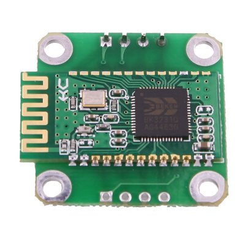
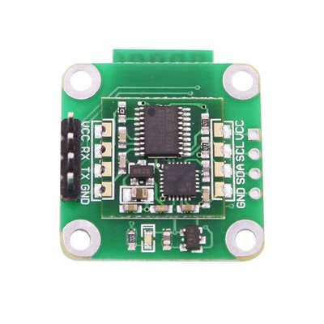

# pymotiontracker
Want to track head or hand movement in your Python application or game?

**pymotiontracker** is a simple Python 3 library to continuously read values from an MPU6050 Bluetooth device on a
non-blocking I/O thread.
These values include:
- Acceleration
- Angular velocity
- Angle
- Temperature (yup, these things do record temperature!)

Numerous solutions available on the web provide motion tracking solutions using an MPU6050 module connected to Bluetooth
module via an Arduino or Raspberry Pi.
I thought this was a bit overkill having a "computer" as the go between the MPU6050 and Bluetooth modules.

There are numerous MPU6050 with integrated Bluetooth modules available to buy and most of them are rather inexpensive.
(Far cheaper than buying an Arduino + Bluetooth module + MPU6050 module.)
However the documentation of these integrated modules are hard to find and rather poor.

The following will attempt to address these shortcoming in a series of tutorials/examples.

## Contents
### 1. Getting your MPU6050 Bluetooth module
You can obtain these from virtually any online electronics store. I found mine on Amazon by searching for "mpu6050 bluetooth". This is essentially an MPU6050 module with a Bluetooth module plonked on top of it.
These modules cost approximately $20. Just make sure it is listed as a 6-axis accelerometer gyroscope.

From the top, the module looks something like this (notice the rectangular Bluetooth module):

And from the bottom like this:

### 2. Power it up!

### 3. Required Python libraries

### 4. Displaying tracked values to console
